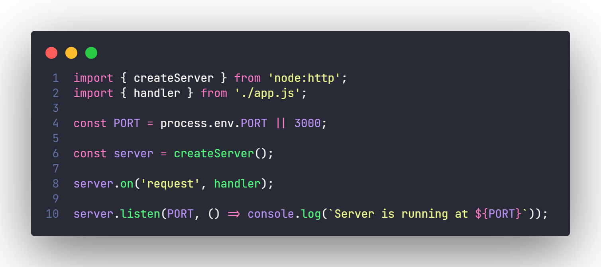

  

### Pure API

Pure API is a Vanilla Node.js API developed whitout frameworks on codebase.

This project uses only Node.js native modules such as `http`, `crypto`, `fs` and others.

### How to run

All you need to do is:

- Clone the repository
- Optionally you can set an `.env` file with the variable PORT to set the server port
- Run `npm start` to start the application
- Then you can access the API on the specified port

### Technologies

This project uses:

- JavaScript
- Node.js with ES6 modules
- Node.js native modules
